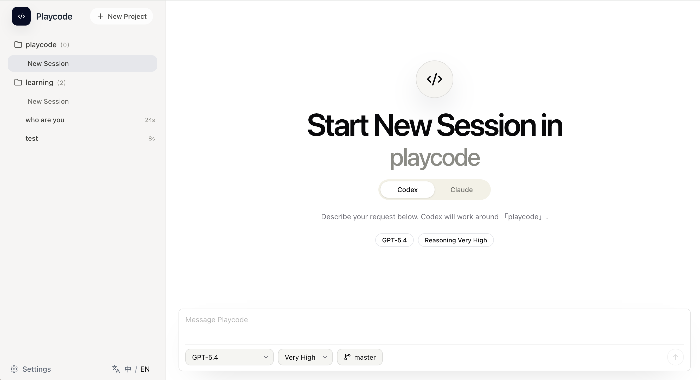

# Playcode （WEB CODEX & CLAUDE）



中文版本: [README.zh.md](./README.zh.md)

Playcode is a web terminal integrating Codex SDK and Claude AGENT SDK, which can run on Windows, macOS, and Linux environments. It does not depend on local codex cli or claude code cli. Supports deployment and use in common Node.js runtime environments such as Windows, macOS, and Linux.

This project references the codex app interface design, providing the same interactive experience as the codex app.

## What scenarios is this suitable for?

- Scenarios where you want to use both codex and claude simultaneously
- Scenarios where you want to use multiple providers
- Breaking through large model concurrency limits, supporting scenarios with a large number of conversations
- Scenarios for deploying codex and claude on Linux servers

## Main Features
- Ability to use both codex and claude for conversations in one project
- Support for multiple providers with provider load balancing capabilities, allowing configuration of concurrent conversation count per provider
- Add any local directory as a project
- Maintain multiple conversations per project, view messages, running status, token usage, and history
- Codex and Claude can run in parallel within the same workspace
- Configure multiple Codex / Claude providers, enable as needed, switch defaults, and adjust models
- Set concurrency limits for individual Codex providers to avoid overwhelming a provider with excessive tasks

## Tech Stack
- Nodejs
- Next.js
- TypeScript
- Tailwind CSS
- shadcn/ui
- SQLite

Model calls are completed directly through server-side SDK by default, no need to pre-install Codex CLI or Claude CLI. Provider API keys, base URLs, models, and concurrency strategies can all be configured in the application's settings page.

## Quick Start

```bash
npm install
npm run dev
```

Open `http://localhost:3000`.

First access will lead to the login page. If there is no admin account in the database yet, the system will automatically switch to the initialization process, create an admin first, and then enter the workspace.

## Common Usage Flow

1. Complete admin initialization or login first
2. Configure system connections, Codex Provider, and Claude Provider on the settings page
3. Add a local directory as a project
4. Create one or more conversations under the project
5. Select Codex or Claude based on task type to proceed
6. View Git information, file previews, and change playback when needed

## Common Scripts

- `npm run dev` - Local development
- `npm run build` - Build for production
- `npm run start` - Start production version
- `npm run lint` - ESLint check
- `npm run typecheck` - TypeScript type check
